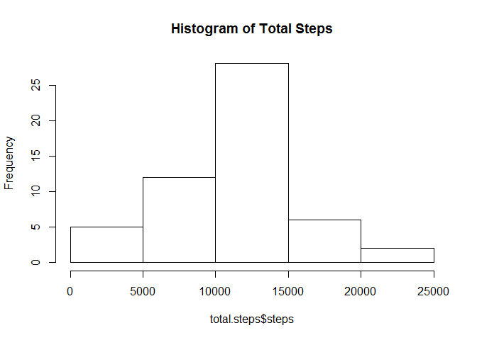
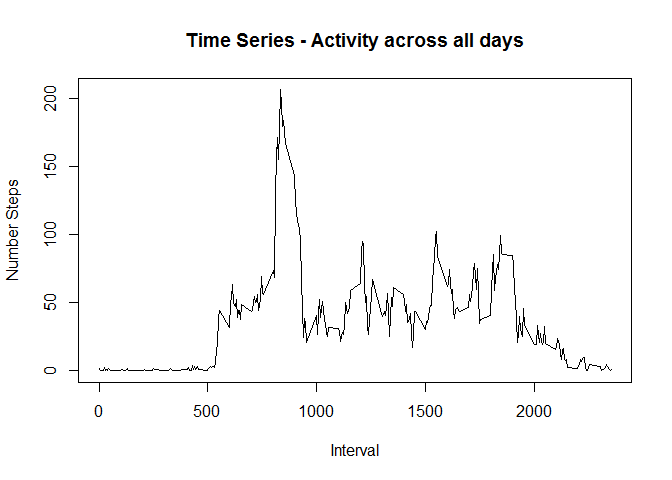
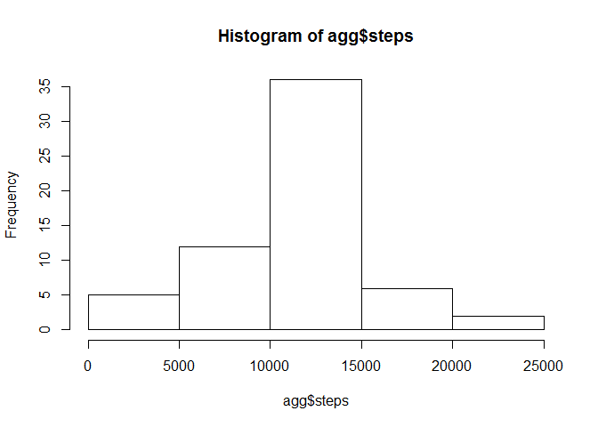
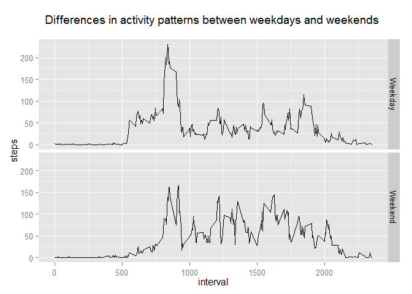

# Reproducible Research: Peer Assessment 1


## Loading and preprocessing the data
Set the Working Directory and Load Raw data

```r
setwd("c:/R Programming/Rep_Research")
df <- read.csv("activity.csv", header=T)
```

## What is mean total number of steps taken per day?
Construct a Data Frame of aggregated data.
Draw a histogram of the total number of steps taken each day.


```r
total.steps <- aggregate( steps ~date , data = df, FUN = sum )
hist(total.steps$steps, main="Histogram of Total Steps")
```

 

Calculate and report the mean and median total number of steps taken per day - missing values are ignored in the dataset.

```r
mean.steps <- mean(total.steps$steps, na.rm=FALSE)
mean.steps
```

```
## [1] 10766
```

```r
median.steps <- median(total.steps$steps, na.rm=FALSE)
median.steps
```

```
## [1] 10765
```


## What is the average daily activity pattern?
A time series plot of the 5-minute interval (x-axis) and the average number of steps taken, averaged across all days (y-axis).

```r
avg.day.activ <- aggregate( steps ~interval , data = df, FUN = mean )

plot(avg.day.activ$interval, avg.day.activ$steps, main="Time Series - Activity across all days", 
     type="l", xlab="Interval", ylab="Number Steps")
```

 

The 5-minute interval that, on average, contains the maximum number of steps is:

```r
avg.day.activ$interval[which.max(avg.day.activ$steps)]
```

```
## [1] 835
```


## Imputing missing values
The total number of missing values in the dataset (i.e. the total number of rows with NAs) is:

```r
sum(is.na(df$steps))
```

```
## [1] 2304
```

A strategy for filling in all of the missing values in the dataset. 
Loop thru values which are NA and replace with mean for that 5 minute interval
(Simple mean imputation approach)

```r
agg <- aggregate( steps ~interval , data = df, FUN = mean )
df2 <- df
for (cnt in 1:nrow(df)) {             
  if (is.na(df2$steps[cnt])) {
      imputed.interval <- df2$interval[cnt]
      imputed.interval.index <- which(agg$interval==imputed.interval)
      df2$steps[cnt] <- agg$steps[imputed.interval.index]
  }
cnt <- cnt+1  
}
```

## What is mean total number of steps taken per day?

```r
agg <- aggregate( steps ~date , data = df2, FUN = sum )
hist(agg$steps)
```

 

```r
mean(agg$steps)
```

```
## [1] 10766
```

```r
median(agg$steps)
```

```
## [1] 10766
```

The results above indicate that due to the imputation strategy taken that the Median has increased from 10765 to 10766. The Mean has remained the same. The Histogram of Total Steps has increased within 10000 - 15000 range.


## Are there differences in activity patterns between weekdays and weekends?


```r
df2$factor <- as.factor(ifelse(weekdays(as.Date(df2$date)) %in% c("Saturday","Sunday"), "Weekend", "Weekday"))

agg <- aggregate( steps ~interval+factor , data = df2, FUN = mean )
```


```r
library("ggplot2")
ggplot(data=agg, aes(interval, steps)) + geom_line() + 
  facet_grid(factor ~ .) +
  ggtitle("Differences in activity patterns between weekdays and weekends \n ")
```

 
